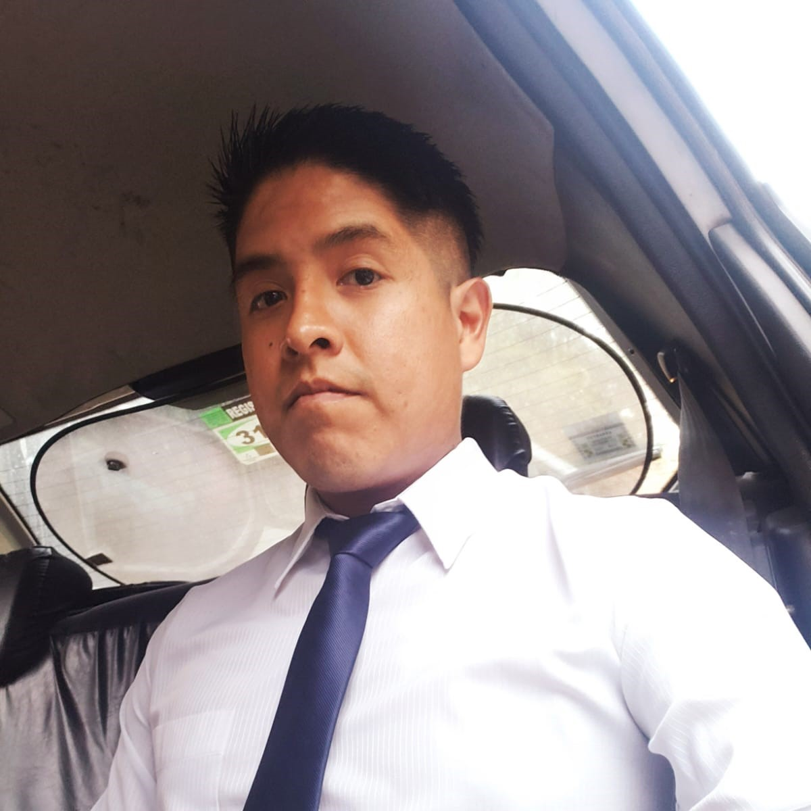

# Proyecto final: Blog Show

## Integrantes:
Ávila, Estefania(Scrum Master)

 
 

Guerrero, Oscar(Teach Lead)

 
 

Herrera, Franco(Developer)

 
 

Zarate, Bernardita(Developer)

 
 

## Link del proyecto:
[https://mosquetero.vercel.app/](https://mosquetero.vercel.app/)

## Repositorios del proyecto(Front-end):
[https://github.com/Osqui2015/mosquetero](https://github.com/Osqui2015/mosquetero)

## Repositorios del proyecto(Back-end):
[https://github.com/Osqui2015/mosqueteroBack](https://github.com/Osqui2015/mosqueteroBack)

## Estructura(Front-end)

    .
    ├── .vscode                             
    ├── my-app/public                           
    ├── public                           
    ├── src                                                                          
    ├── .gitignore
    ├── README.md
    ├── package-lock.json                       
    └── package.json

## Estructura(Back-end)

    .
    ├── node_modules                                                                                           
    ├── server
    ├── package-lock.json
    ├── package.json                        
    └── vercel.json

## Fecha presentación
La presentación del proyecto será en forma grupal, el 5/12/2022.